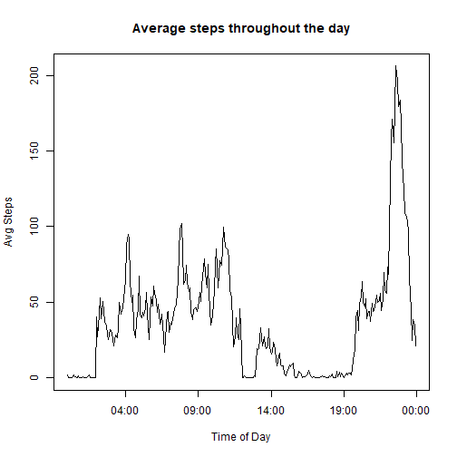

## Introduction

In this project, data was taken from a personal activity monitoring device and explored in several ways.The data consisted of the number of steps taken every 5 minutes across two months (October through November of 2012). The data consisted of 3 variables, the nuber of steps taken, the date of the activity (YYYY-MM-DD) and the 5 minute interval the activity recorded. 

The data was explored in 6 ways:
1. A histrogram of the total steps taken each day
2. The mean/median of the above data
3. A time series plot of steps taken each day
4. The 5 minute interval with the most steps taken, on average
5. Repeating steps 1 and 2 after filling in missing values in the original data
6. Time series plots showing difference in activity over weekends and weekdays

The very first step was to read the data into R


```r
zipped <- "activity.zip"
unzip(zipped)
df <- read.csv("activity.csv", colClasses = c("numeric","character","character"))
```

## 1: Creating the histogram


```r
TotpDay <- tapply(df$steps,df$date,sum)
hist(TotpDay, main = "Histogram of steps/day", xlab = "Total Steps")
```

-1.png)

The histogram showed that the subject averaged between 10 to 15 thousand steps per day

## 2: Getting the averages of the data


```r
avgsteps <- mean(TotpDay, na.rm = TRUE)
medsteps <- median(TotpDay,na.rm = TRUE)
print(avgsteps)
```

```
## [1] 10766.19
```

```r
print(medsteps)
```

```
## [1] 10765
```

The mean and median steps are shown above

## 3: Creating the plot of steps taken per day

The first step to creating the plot of steps taken per day was to convert the interval variable from a character vector into a time. This was done by formatting the interval from a HM forat into a H:M, then using base r as.POSIXct to do the rest.

```r
df$interval <- sub('(\\d{2})$', ':\\1', df$interval)
for (i in 1:nrow(df)) {
    
    if (nchar(df$interval[i]) == 1) {
        df$interval[i] <- paste("0:0",df$interval[i], sep = "")
    } else if (nchar(df$interval[i]) == 3) {
        df$interval[i] <- paste("0",df$interval[i], sep = "")
    }
    
}
df$time <- as.POSIXct(df$interval, format = "%H:%M")
```

From there, the averages were calculated the same way, but with this new time variable


```r
avgpint <- tapply(df$steps,df$interval,FUN = function(x) mean(x,na.rm = TRUE))
plot(x = df$time[1:288], y = avgpint, xlab = "Time of Day", ylab = "Avg Steps", 
     main = "Average steps throughout the day", type = "l")
```



## 4: Finding the max of the 5 minute intervals

This was a very simple exercise, just using the which.max function

```r
which.max(avgpint)
```

```
## 8:35 
##  272
```

## 5: Filling in the missing values
To fill in the missing values, the position of the missing values was recorded in a variable napos. These missing values were then replaced with the average steps taken for that interval.


```r
nas <- sum(is.na(df$steps))
napos <- which(is.na(df$steps))
dfnona <- df
for (j in napos) {
    dfnona$steps[j] <- avgpint[names(avgpint) == dfnona$interval[j]]
}
```

This new data set was then used to recreate the histogram and recalculate the average and median


```r
TotpDaynona <- tapply(dfnona$steps,dfnona$date,sum)
hist(TotpDaynona, main = "Histogram of steps/day", xlab = "Total Steps")
```


```r
avgstepsnona <- mean(TotpDaynona)
medstepsnona <- median(TotpDaynona)

print(avgstepsnona)
```

```
## [1] 10766.19
```

```r
print(medstepsnona)
```

```
## [1] 10766.19
```

## 6: Graphing weekends vs weekdays

A factor variable was created splitting the days between weekdays and weekends. This was expanded to include the interval of time as well.

```r
dfnona$date <- as.POSIXct(dfnona$date)
dfnona$Weekday <- weekdays(dfnona$date, abbreviate = TRUE)

dfnona$Weekdiff <- "Weekday"
dfnona$Weekdiff[dfnona$Weekday == "Sun" | dfnona$Weekday == "Sat"] <- "weekend"
dfnona$Weekdiff <- as.factor(dfnona$Weekdiff)
dfnona$weekdiffint <- as.factor(paste(dfnona$Weekdiff,dfnona$interval,sep = " "))

avgweekdiff <- tapply(dfnona$steps,dfnona$weekdiffint,mean)
```

The ggplot2 package was used to create the plot. 

```r
library(ggplot2)
plotdata <- data.frame(steps = avgweekdiff, interval = rep(df$time[1:288],2), 
                       weekday = as.factor(c(rep("Weekday",288),rep("Weekend",288))))

g1 <- ggplot(data = plotdata, aes(x = interval, y = steps))
g1 <- g1 + facet_wrap(~ weekday, nrow = 2) + geom_line() + xlab("Time") +
    ggtitle("Steps across Weekdays and Weekends") + scale_x_datetime(date_breaks = "2 hour", date_labels = "%H:00", expand = c(0, 0))
print(g1)
```


